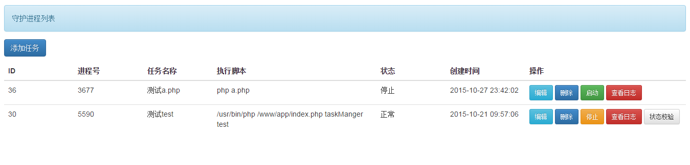
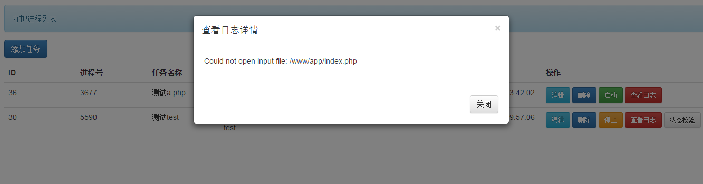

#This is a PHP process management tools

PHP任务后台进程管理工具 

####有如下功能：
 * 使用PHP实现对某个php-fpm进程的控制,包括你可以开始它,停止它,或者直接杀掉进程; 
 * 该工具支持对启动进程产生的异常进行记录日志,方便排错;

####用途：用于需要后台进程形式跑脚本数据的php进程管理,例如：定时落地数据到mysql、循环检测msg进行推送等场景。

#依赖

* 仅使用CodeIgniter2.3 框架驱动,原生PHP实现
* 你随时可以迁移到你自己的框架中

#TODO

* 任务进程前后置操作
* 任务进程的监控以及报警

#####这是一个雏形的工具,还处在beta版的开发阶段,请完善后使用，如果有任何问题请联系：
 * QQ:654734702
 * 邮件：(654734702#qq.com,把#换成@) 

#部分截图

